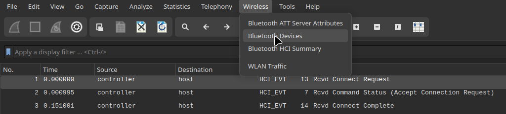

# Challenges

## The subject

&nbsp;
## FTP - Authentification
>### Subject

>### Solution
1. Copy link button start of challenge on an new tabs in your navigator who download file `ch1.pcap`
2. Open this file (`ch1.pcap`) on wireshark
3. Search FTP protocol
4. Follow TCP stream 
&nbsp;
> &nbsp;
>

&nbsp;
## TELNET - Authentification
>### Subject

>### Solution
1. Copy link button start of challenge in a new tabs in your navigator who download file `ch2.pcap`
2. Open this file `ch2.pcap` on wireshark
3. Search TELNET protocol
4. Follow TCP stream

&nbsp;
## ETHERNET - trame
>### Subject

>### Solution
1. Copy link button start of challenge in a new tabs in our navigator.
You will get a text at hexdecimal
2. Convert this hexdecimal text to text human read and you get text on base64 (like: SvwsdIUOVBOIU===)
3. After you have text base64, you convert this to text human read and will get the password

&nbsp;
## Authentification twitter
>### Subject

>### Solution
1. Copy link button start of challenge in new tabs in your navigator who download file `ch3.pcap`
2. Open this file `ch3.pcap` on wireshark
4. Follow TCP stream the uniq transmition HTTP
5. Convert the text base64 at line _Authorization_ to get the password

&nbsp;
## Bluetooth - Fichier inconnu
>### Subject

>### Solution
1. Copy link in button start challenge in new tabs in your navigator who download file `ch18.bin`
2. Open this file `ch18.bin` on wireshark
3. Open wireless on tool bar of wireshark, click on bluetooth device and you got `name` and `br_addr` who is the address mac
4. Concat address mac whit phone name and convert to SHA1 to get the password

